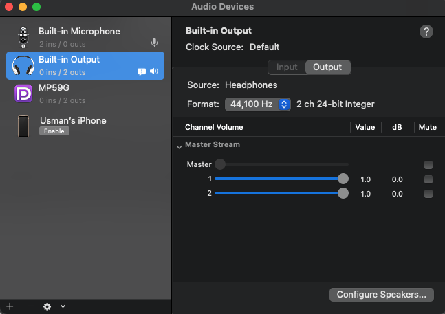
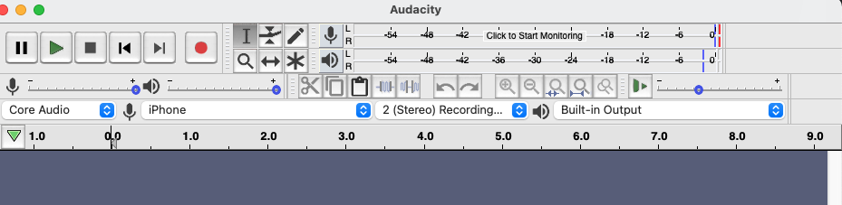

I used to be an avid radio listener until i started using phones that can lack the functionality (damn you Apple). Lately, I started enjoying listening to conversations on clubhouse especially when i am working. so, I thought to myself how do i listen to it on my sound bar that is connected to my macbook. But before I can achieve this I have some hurdles i need i must overcome.

Firstly, I need to figure out a way to connect my Iphone to the macbook as an audio input device. This problem was easily solved by connecting the phone to the laptop and enabling it in the Audio MIDI Setup as an audio input device. 

This takes us to the next problem, I quickly find out that I need a way to playback the sound coming from the phone. Here, Audacity came to my rescue, I was able to play the sound coming from the phone by setting it as the input device in audacity and click the "click to start monitoring" to start the playback.

